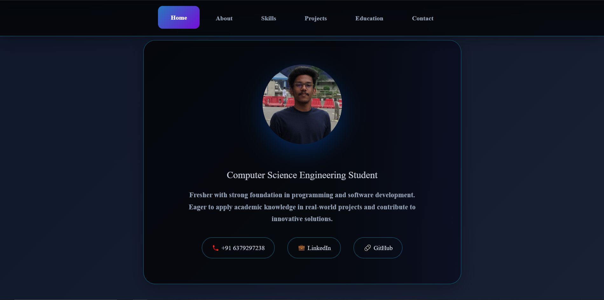

# Portfolio Website - S.Aakash

This is a personal portfolio website for S.Aakash, a Computer Science Engineering student. The site showcases academic background, technical skills, projects, and contact information.

## Features

- **Responsive Design:** Works on desktop, tablet, and mobile devices.
- **Smooth Navigation:** Fixed navbar with animated scroll and active section highlighting.
- **Animated Sections:** Fade-in and slide-in effects for content and skills.
- **Contact Form:** Validated form with notification feedback (no backend, demo only).
- **Scroll Progress Indicator:** Shows how much of the page has been viewed.
- **Academic Projects & Timeline:** Highlights education and key projects.

## Structure

- `index.html` - Main HTML file containing all content, styles, and scripts.
- `8.jpg` - Profile image used in the Home section.

## Usage

1. Clone or download the repository.
2. Place your profile image as `8.jpg` in the root directory.
3. Open `index.html` in your browser.

## Customization

- **Profile Image:** Replace `8.jpg` with your own photo.
- **Content:** Edit sections in `index.html` to update your details, skills, projects, and contact info.
- **Styling:** Modify the CSS in the `<style>` block for color, fonts, and layout changes.

## Demo

## Contact

For questions or suggestions, reach out via the contact form on the website or email: sa9932@srmist.edu.in

---

**Live Preview:**  
Open `index.html` directly in your browser to view the